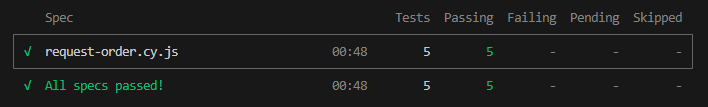
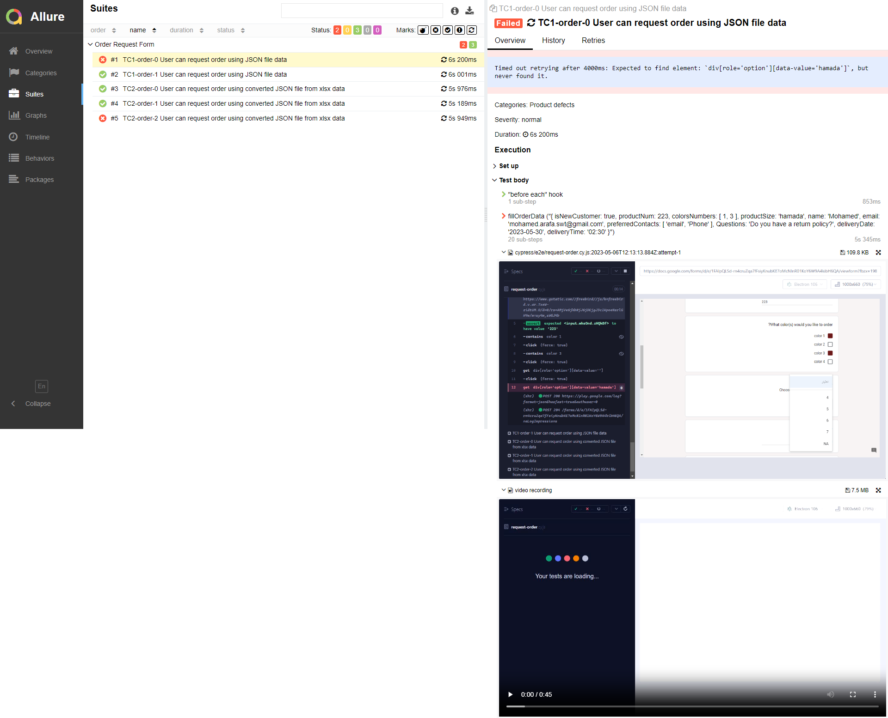
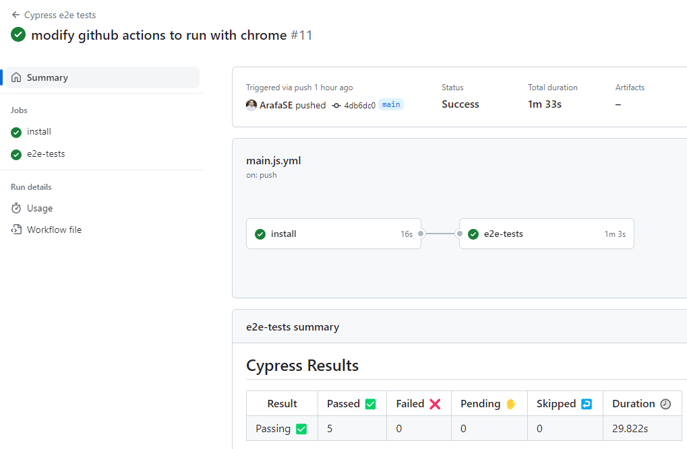

# cypress-data-driven-framework

Cypress starter data driven testing project support reading data from JSON and XLSX formates

## Test Data input files
You can add all test data in the **ordersData.excel.xlsx** or **orderdata.json** files added under the fixtures folder
```
📦 cypress-data-driven-framework
┣ 📂 cypress
┃ ┣ 📂 fixtures
┃ ┃ ┃ 📄 ordersData.excel.xlsx
┃ ┃ ┃ 📄 ordersdata.json
```

## How to run the project locally?  :rocket:
- first you need to clone the repo then install the dependencies
```
git clone https://github.com/ArafaSE/cypress-data-driven-framework.git
npm install
```
- run the the Cypress tests using npm
```
npm run test
```
Or run using cypress npx
```
npx cypress run
``` 

## The Reports :page_facing_up:
- Cypress generated **mocha** report by default and you can check the status in the terminal directly

- The project also use the **Allure** report for generating the reports after running
- The allure reports files located in project root file under /allure-results folder
- but you need to install Allure in your local machine to be able to read these reports

If you are on **windows** you can execute the bellow commands to install Allure:  :shipit:
```
 Set-ExecutionPolicy RemoteSigned -scope CurrentUser
 iwr -useb get.scoop.sh | iex
 scoop install allure
```
Or if you run on **Linux**:
```
 sudo apt-add-repository ppa:qameta/allure
 sudo apt-get update
 sudo apt-get install allure
```
Or If you are a lucky man and run on **Mac** it's only one command:
```
 brew install allure
```
- After install the Allure on your machine run the cypress tests again then run this command to open the report:
 ```
 allure serve
 ```
This will open the browser tap contains an html report with a lot of details including test steps, logs, and screenshot/videos for the failed tests 
 

## CI/CD :electron:
The test cases are integrated to the GitHub actions workflow, running on a separate job 'e2e-tests' you can find all the workflow history in GitHub Actions tap
